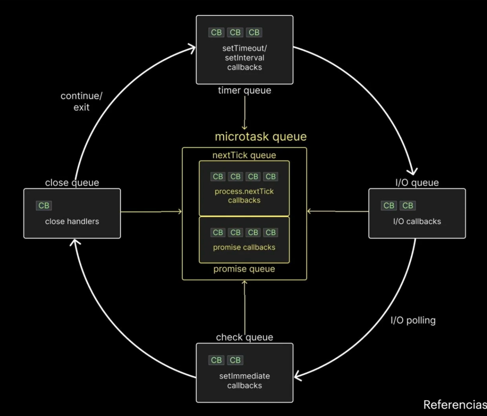

# Qué es libuv
Libuv librería que viene con Node.js para poder hacer tareas de entrada/salida 
(I/O) sin bloquear el hilo principal. Ej: leer archivos, consultar red,
conectarse a una base de datos, temporizadores, sockets...

```
Tu código TS/JS
   ↓
Node.js
   ↓
libuv
   ↓
Sistema operativo
```

# Ejemplos bloqueante / no bloqueante
```js
fs.readFile(...)        // no bloqueante
fs.readFileSync(...)    // Sync = síncrono = bloqueante

fs.writeFile(...)       // no bloqueante
fs.writeFileSync(...)   // bloqueante
```

# Event loop
Muchas cosas "a la vez" sin tener muchos hilos ejecutando

## Proceso
1. Node ejecuta tu JS en un hilo principal.
2. Cuando algo tarda, como leer archivo o consultar DB, lo delega.
3. Mientras tanto, sigue atendiendo otras cosas.
4. Cuando la tarea termina, el event loop recupera el callback/promesa y lo 
   ejecuta.

```js
console.log('1')            // 1

setTimeout(() => {        
  console.log('2')          // 3
}, 0)

console.log('3')            // 2
```

## Promesas sobre callbacks
Las promesas suelen tener prioridad sobre timers/callbacks normales:



1. Ejecuta todo el código normal. (call stack)
2. Cuando termina, mira la cola de microtasks.
3. Después mira timers, callbacks de I/O, etc.

```js
console.log('1')                                          // 1
setTimeout(() => console.log('timeout'), 0)               // 4
Promise.resolve().then(() => console.log('promise'))      // 3
console.log('2')                                          // 2
```

El Event Loop sigue ciertas reglas

1. Callbacks en el microtask se ejecutan primero.
2. Todos los callbacks dentro del timer queue se ejecutan.
3. Callbacks en el microtask queue (si hay) se ejecutan después de los callback
  timers, primero tareas en el nextTick queue y luego tareas en el promise 
  queue.
4. Callbacks de I/O se ejecutan.
5. Callbacks en el microtask queue se ejecutan (si hay), y luego promise queue
   (si hay).
6. Todos los callbacks en el check queue se ejecutan.
7. Callbacks en el microtask se ejecutan después de cada callback en el check 
   queue. (Siguiendo el mismo orden anterior, nextTick y luego promise)
8. Todos los callbacks en el close queue son ejecutados.
9.  Por una última vez en el mismo ciclo, los microtask queues son ejecutados 
    de la misma forma, nextTick y luego promise queue.